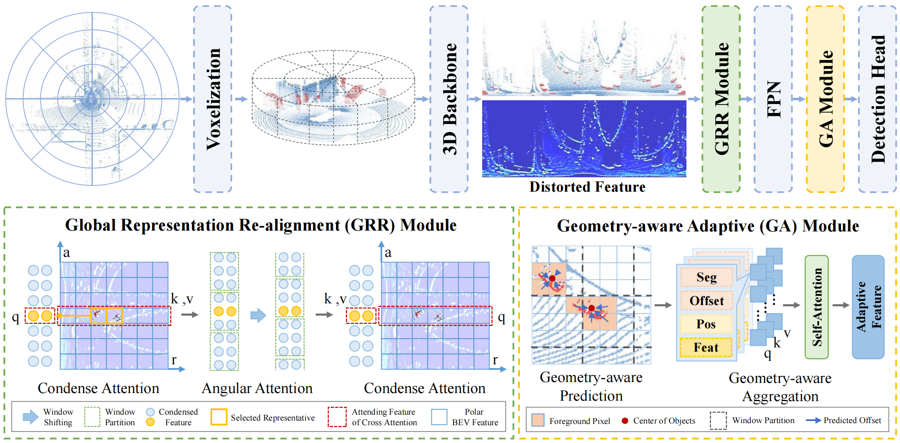

# PARTNER: Level up the Polar Representation for LiDAR 3D Object Detection

> [**PARTNER: Level up the Polar Representation for LiDAR 3D Object Detection**](https://arxiv.org/abs/2308.03982),            
> Ming Nie, Yujing Xue, Chunwei Wang, Chaoqiang Ye, Hang Xu, Xinge Zhu, Qingqiu Huang, Michael Bi Mi, Xinchao Wang, [Li Zhang](https://lzrobots.github.io)  
> **ICCV 2023**

**This is a official implementation of ICCV 2023 paper** [PARTNER: Level up the Polar Representation for LiDAR 3D Object Detection](https://arxiv.org/abs/2308.03982) for polar-based 3D object detection.


## Introduction


PARTNER alleviates the dilemma of feature distortion with global representation re-alignment and facilitates the regression by introducing instance-level geometric information into the detection head.

We provide code and training configurations of PARTNER under ```configs```.  


## Requirements
The codes are tested in the following environment:
* Ubuntu 18.04
* Python 3.7+
* PyTorch 1.6+
* CUDA 10.2+
* [APEX](https://github.com/nvidia/apex)
* [spconv](https://github.com/traveller59/spconv) 

## Installation
a. Clone this repository.

b. Install the dependent libraries as follows:

* Install the dependent python libraries: 
```
pip install -r requirements.txt 
```

* Install the APEX library:
```bash
git clone https://github.com/NVIDIA/apex
cd apex
pip install -v --no-cache-dir --global-option="--cpp_ext" --global-option="--cuda_ext" ./
```

* Install the SparseConv library, we use the implementation from [`[spconv]`](https://github.com/traveller59/spconv). 
```bash
pip install spconv-cu114
```

c. Compile CUDA operators by running the following command:
```shell
python setup.py develop
```

## Training

We provide training configurations of PARTNER under ```configs```.  
All the models are trained with Tesla V100 GPUs (32G).
If you use different number of GPUs for training, it's necessary to change the respective training epochs to attain a decent performance.

Use the following command to start a distributed training using 8 GPUs. The models and logs will be saved to ```work_dirs/CONFIG_NAME```. 

```bash
python -m torch.distributed.launch --nproc_per_node=8 ./tools/train.py CONFIG_PATH
```

For distributed testing with 8 gpus,

```bash
python -m torch.distributed.launch --nproc_per_node=8 ./tools/dist_test.py CONFIG_PATH --work_dir work_dirs/CONFIG_NAME --checkpoint work_dirs/CONFIG_NAME/latest.pth 
```

## Reference
If you find our work useful in your research, please consider citing our paper:
```
@inproceedings{nie2023partner,
  title={PARTNER: Level up the Polar Representation for LiDAR 3D Object Detection},
  author={Nie, Ming and Xue, Yujing and Wang, Chunwei and Ye, Chaoqiang and Xu, Hang and Zhu, Xinge and Huang, Qingqiu and Mi, Michael Bi and Wang, Xinchao and Zhang, Li},
  booktitle={Proceedings of the IEEE/CVF International Conference on Computer Vision},
  year={2023}
}
```

## Acknowledgements
We thanks for the opensource codebases, [det3d](https://github.com/poodarchu/det3d) and [polarstream](https://github.com/motional/polarstream).
